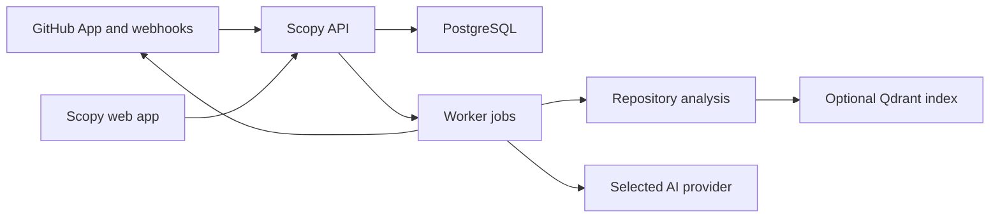

Self-hosted Scopy is a web app, an API, a background worker, PostgreSQL, and optional Qdrant semantic search. The API and worker share the same codebase and database, but they run as separate processes in production.

## Runtime pieces

| Piece            | Responsibility                                                                                            |
| ---------------- | --------------------------------------------------------------------------------------------------------- |
| Web app          | Authenticated UI for onboarding, repositories, pull requests, analytics, billing, and workspace settings. |
| API              | Routes, auth, database access, GitHub integration, billing, analytics, and review orchestration.          |
| Worker           | Background processing for GitHub webhooks and pull request review jobs.                                   |
| Repository tools | Diff parsing, file reading, text search, symbol lookup, and optional semantic search.                     |
| PostgreSQL       | Auth, workspaces, repositories, pull requests, review runs, findings, billing, and worker jobs.           |

## Review flow

For each review, Scopy:

1. Fetches pull request files from GitHub.
2. Applies repository include and exclude settings.
3. Builds readable diff context.
4. Checks out repository context for deeper inspection.
5. Collects affected symbols, related files, text search results, and optional semantic context.
6. Runs the main reviewer model.
7. Runs a verifier model over candidate findings.
8. Publishes confirmed findings to GitHub.
9. Records status, usage, billing data, and debug artifacts.

## Data and artifacts

PostgreSQL stores the primary product state: users, sessions, workspaces, repositories, pull requests, review runs, findings, billing, and worker jobs.

Review workspaces are written under `REVIEW_WORKDIR`. Debug artifacts are written under `REVIEW_RUNS_DIR`. Persist these paths when you need to inspect review behavior after restarts.
